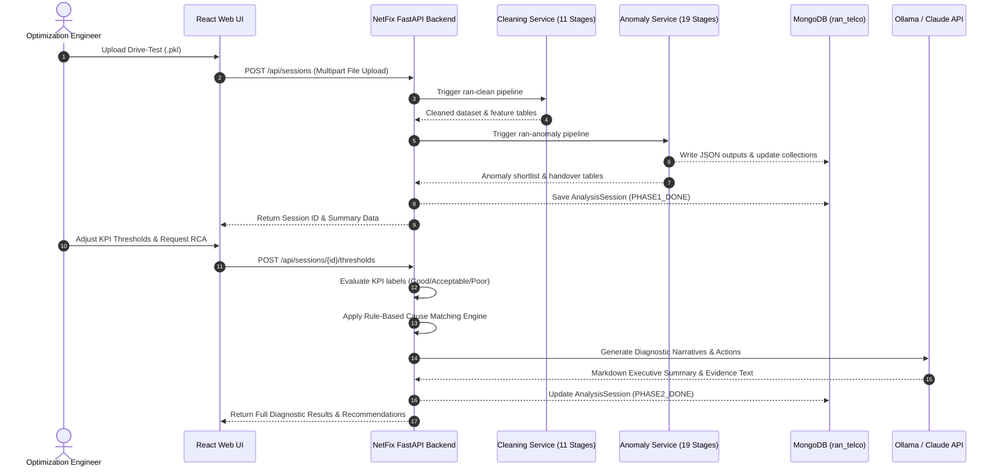

# NetFix RAN Telco Platform

An end-to-end, enterprise-grade Telecom Radio Access Network (RAN) Drive-Test Data Processing, ML-Powered Anomaly Detection, Interactive Root Cause Analysis (RCA), and Spatial GIS Visualization Platform.

The platform processes raw drive-test datasets, performs multi-stage statistical and deep learning anomaly detection, maps root-cause network degradation drivers using a deterministic rule engine, and provides plain-language executive diagnostic narratives via local or cloud LLMs.

---

## 📋 Table of Contents

- [Overview & Architecture](#-overview--architecture)
- [Key Features](#-key-features)
- [Repository Structure](#-repository-structure)
- [Detailed Component Breakdown](#-detailed-component-breakdown)
  - [1. Web Frontend (`front_end/`)](#1-web-frontend-front_end)
  - [2. NetFix Orchestration Backend (`netfix-backend`)](#2-netfix-orchestration-backend-netfix-backend)
  - [3. RAN Data Cleaning Service (`ran-cleaning-service`)](#3-ran-data-cleaning-service-ran-cleaning-service)
  - [4. RAN Anomaly Detection Service (`ran-anomaly-service`)](#4-ran-anomaly-detection-service-ran-anomaly-service)
  - [5. KPI Labeling & Reason Matching Services](#5-kpi-labeling--reason-matching-services)
- [System Data Flow](#-system-data-flow)
- [Prerequisites](#-prerequisites)
- [Quick Start Guide](#-quick-start-guide)
  - [Option A: Docker Compose (Recommended)](#option-a-docker-compose-recommended)
  - [Option B: Standalone / Manual Setup](#option-b-standalone--manual-setup)
- [API Reference](#-api-reference)
- [Configuration & Environment Variables](#-configuration--environment-variables)
- [Data Storage & MongoDB Collections](#-data-storage--mongodb-collections)
- [Troubleshooting & Logs](#-troubleshooting--logs)

---

## 📡 Overview & Architecture

Modern cellular networks generate complex drive-test and telemetry data. Identifying performance bottlenecks, coverage holes, interference, and throughput degradation requires combining spatial analysis, statistical modeling, machine learning, and domain expert reasoning.

The **NetFix RAN Telco Platform** unifies these tasks into a seamless **Two-Phase Architecture** centered around a persistent **Analysis Session**:

```
 ┌────────────────────────────────────────────────────────────────────────────────────────┐
 │                               PHASE 1: AUTOMATIC INGESTION                             │
 │                                                                                        │
 │   Raw PKL Drive-Test   ──►   RAN Data Cleaning   ──►   Multi-Model Anomaly Detection   │
 │         Data                      (11 Stages)                  (19 Stages)             │
 │                                                                     │                  │
 │                                                                     ▼                  │
 │                                                         Persist Analysis Session       │
 │                                                              (MongoDB)                 │
 └──────────────────────────────────────────────────────────────────┬─────────────────────┘
                                                                    │
 ┌──────────────────────────────────────────────────────────────────▼─────────────────────┐
 │                              PHASE 2: INTERACTIVE RCA & DIAGNOSTICS                    │
 │                                                                                        │
 │   Custom KPI Thresholds   ──►   KPI Labeling   ──►   Deterministic Rule-Based        │
 │      (User Input)             (Good/Accept/Poor)        Cause Matching Engine        │
 │                                                                     │                  │
 │                                                                     ▼                  │
 │                                                           AI Diagnostic Narrative      │
 │                                                          (Ollama Llama3.1 / Claude)    │
 └────────────────────────────────────────────────────────────────────────────────────────┘
```

- **Phase 1 (Automatic, runs once per upload):** Cleans drive-test pickle data, extracts spatial/temporal window features, runs statistical scoring, ML cross-validation (Histogram Gradient Boosting), PyTorch LSTM temporal models, and statistical-ML-LSTM fusion. Results are stored in MongoDB.
- **Phase 2 (Interactive, re-runnable):** Evaluates cellular KPI thresholds against network standards, applies deterministic rule-based root cause matching, and prompts an LLM to generate actionable troubleshooting steps and executive summaries.

---

## ✨ Key Features

- 🛰️ **Full RAN Data Pipeline:** 11-stage cleaning + 19-stage anomaly detection with zero data leakage.
- 📊 **Advanced Anomaly Fusion:** Blends robust z-scores, P75 expected throughputs, HGB ML models, and PyTorch LSTM sequence predictions.
- 🗺️ **Interactive GIS Map:** Real-time visualization of drive-test trajectories, cell tower locations (PCI/ECI), signal coverage (RSRP/RSRQ/SINR), and anomaly pinpoints.
- 🎯 **Rule-Based Root Cause Matching:** Deterministic matching against a 34-reason cellular degradation taxonomy without non-deterministic embedding errors.
- 🤖 **AI Copilot & Diagnostic Explanations:** Multi-mode assistant (Chat & Deep Reasoning) backed by local Ollama (`llama3.1`) or Anthropic Claude API.
- 📈 **Visualization Gallery:** Automatically renders and exports PNG/JSON quality plots, KPI boxplots, cumulative distribution functions, and anomaly heatmaps.
- 🐳 **Containerized Microservices:** Fully orchestrated via Docker Compose with dedicated containers for API, workers, MongoDB, and local LLM runtime.

---

## 📂 Repository Structure

```
Platform/
├── front_end/                                 # Web Frontend Application
│   └── Generate Deliverables/
│       ├── src/
│       │   ├── App.tsx                        # Main React App (Dashboard, RCA, Chat, Visualizations)
│       │   ├── InteractiveMapView.tsx         # Leaflet/Custom GIS Interactive Map
│       │   ├── api.ts                         # REST API integration layer
│       │   └── index.css                      # Tailwind CSS v4 styling & theme setup
│       ├── package.json                       # Dependencies (React 19, Vite, Recharts, Lucide)
│       ├── vite.config.ts                     # Vite bundler configuration
│       └── tsconfig.json                      # TypeScript configuration
│
└── ran-telco-platform_tar_flag/
    └── ran-telco-platform/                    # Core Backend & Microservices
        ├── docker-compose.yml                 # Main Docker Compose orchestration spec
        ├── netfix-backend/                    # Two-Phase FastAPI Orchestration Server & CLI
        │   ├── src/netfix_backend/
        │   │   ├── api/                       # REST API routers & controllers
        │   │   ├── cli/                       # Command-line interface (`netfix-backend`)
        │   │   ├── domain/                    # AnalysisSession domain models
        │   │   ├── infra/                     # MongoDB & In-Memory session repositories
        │   │   ├── orchestration/             # Phase 1 & Phase 2 execution workflows
        │   │   ├── rules/                     # Deterministic cause-matching catalog
        │   │   └── services/                  # Business logic wrappers around subservices
        │   └── pyproject.toml
        │
        ├── ran-cleaning-service/              # 11-stage modular drive-test cleaning pipeline
        │   ├── src/ran_cleaning/
        │   │   ├── cli.py                     # `ran-clean` executable CLI
        │   │   ├── run_pipeline.py            # Exec-based pipeline runner
        │   │   └── stages/ (01 to 11)         # Cleaning, profiling, & feature engineering
        │   └── pyproject.toml
        │
        ├── ran-anomaly-service/               # 19-stage modular anomaly detection pipeline
        │   ├── src/ran_anomaly/
        │   │   ├── cli.py                     # `ran-anomaly` executable CLI
        │   │   ├── mongo_writer.py            # MongoDB sync writer for anomaly outputs
        │   │   ├── run_pipeline.py            # Exec-based pipeline runner
        │   │   └── stages/ (01 to 19)         # Z-scores, ML, PyTorch LSTM, & Fusion layer
        │   └── pyproject.toml
        │
        ├── ran-kpi-labeling-service/          # Threshold evaluation service (Good/Acceptable/Poor)
        ├── ran-reason-matching-service/       # Vector RAG & legacy reason-matching service
        ├── docker/                            # Custom Dockerfiles for Mongo, Services, & Tools
        ├── Raw_Data/                          # Input directory for raw `.pkl` drive-test files
        ├── Reasons_Data/                      # Root cause taxonomy graph definitions
        └── outputs/                           # Pipeline output files (CSV, Parquet, JSON, PNG)
```

---

## 🔍 Detailed Component Breakdown

### 1. Web Frontend (`front_end/`)

Built with **React 19**, **TypeScript**, **Vite**, **Tailwind CSS v4**, **Recharts**, and **Lucide React**.

- **User Authentication:** Login and Registration views supporting role-based access (e.g., Optimization Engineer, RF Planner).
- **Data Ingestion Portal:** Drag-and-drop `.pkl` file uploader with live upload speed (MB/s) and real-time progress indicators.
- **Executive Dashboard:** High-level overview of total anomalies, severity distribution, cellular KPI averages, and recent analysis sessions.
- **GIS Trajectory Map:** Interactive map displaying GPS drive-test trajectories, cell tower sites, PCI clusters, and pinpoint anomaly markers with detailed tooltip metadata.
- **Root Cause Analysis Inspector:** Deep-dive interface for inspecting specific incidents, viewing matched underlying network causes, reviewing key evidence metrics (RSRP, RSRQ, SINR, BLER, CQI, MCS, RB Usage), and reading AI-generated mitigation strategies.
- **Interactive Visualizations:** Interactive chart gallery displaying generated distribution plots, empirical CDFs, and quality flag counts.
- **AI Copilot Chat:** Embedded assistant for real-time natural language queries over the dataset, supporting standard mode and step-by-step reasoning mode.

### 2. NetFix Orchestration Backend (`netfix-backend`)

The central coordination engine built with **FastAPI** and **Python 3.10+**.

- Unifies data cleaning, anomaly detection, threshold evaluation, and AI explanations under a single **Analysis Session**.
- Exposes both a **REST API** (`http://localhost:8000`) and an administrative **CLI** (`netfix-backend`).
- Implements deterministic rule-based root cause matching using the condition catalog (`rules/condition_catalog.py`), eliminating flaky LLM classification errors.
- Connects to local **Ollama** instances (`llama3.1`) or **Anthropic Claude** for narrative generation.

### 3. RAN Data Cleaning Service (`ran-cleaning-service`)

Executes an 11-stage modular pipeline (`ran-clean`):

| Stage | Module | Description |
|---|---|---|
| **01** | `01_imports_and_settings.py` | Environment setup, directory allocation, headless matplotlib configuration. |
| **02-04** | Helper Modules | General utilities, data profiling, geo/time conversion helpers. |
| **05-06** | `05_load_raw_pickle.py`, `06_profile...` | Ingests raw drive-test pickle files, constructs cleaning plans. |
| **07-08** | Feature & Column Detection | Derives spatial/temporal attributes, detects canonical LTE throughput columns. |
| **09-10** | Filtering & Alias Mapping | Expands event/activity tables, filters LTE-DL records. |
| **11** | `11_quality_bins_flags...` | Computes quality bins, neighbor cell aggregates, and event-window features. |

### 4. RAN Anomaly Detection Service (`ran-anomaly-service`)

Executes a 19-stage statistical, ML, PyTorch LSTM, and multi-layer fusion engine (`ran-anomaly`):

| Stage Range | Focus Area | Key Algorithms & Methods |
|---|---|---|
| **01 - 04** | Statistical Scoring | Calculates z-scores, robust estimators, and group-based P75 expected throughputs. |
| **05 - 07** | Initial RCA & Visual QC | Combines statistical anomaly flags, severity levels, and builds initial handoff tables. |
| **08 - 11** | Machine Learning Pipeline | Leakage-safe feature construction, cross-fitting using Histogram Gradient Boosting. |
| **12 - 14** | PyTorch LSTM Sequences | Sequence construction, PyTorch LSTM-Q50 cross-fitting for temporal anomaly detection. |
| **15 - 19** | Fusion & Final Incidents | Multi-layer Statistical-ML-LSTM fusion, candidate episode clustering, incident shortlist generation. |

### 5. KPI Labeling & Reason Matching Services

- **`ran-kpi-labeling-service`:** Evaluates network metrics against standard telecom thresholds:
  - **RSRP:** Good (> -90 dBm), Acceptable (-105 to -90 dBm), Poor (< -105 dBm)
  - **RSRQ:** Good (> -10 dB), Acceptable (-15 to -10 dB), Poor (< -15 dB)
  - **SINR:** Good (> 13 dB), Acceptable (0 to 13 dB), Poor (< 0 dB)
  - **BLER:** Good (< 5%), Acceptable (5 to 10%), Poor (> 10%)
- **`ran-reason-matching-service`:** Matches network evidence against a 34-reason taxonomy graph covering coverage holes, pilot pollution, high BLER, handover failures, and RB congestion.

---

## 🔄 System Data Flow



---

## 💻 Prerequisites

- **Operating System:** Linux (Ubuntu 20.04/22.04 recommended), macOS, or Windows WSL2.
- **Containerization:** Docker v24.0+ & Docker Compose v2.20+.
- **Node.js Environment (for standalone frontend):** Node.js v18.x or v20.x, `pnpm` or `npm`.
- **Python Environment (for standalone backend):** Python v3.10+, `pip`, virtualenv/conda.
- **Hardware Recommendations:**
  - **CPU:** 8+ cores recommended for multi-stage ML/LSTM cross-fitting.
  - **RAM:** Minimum 16 GB (32 GB recommended for large pickle files).
  - **GPU:** Optional (PyTorch LSTM will utilize CUDA if available, falls back to CPU).

---

## 🚀 Quick Start Guide

### Option A: Docker Compose (Recommended)

The entire stack—including MongoDB, local LLM runtime, backend API, and microservices—can be launched with a single command.

#### 1. Place Data Files
Place your raw drive-test pickle file inside `./ran-telco-platform_tar_flag/ran-telco-platform/Raw_Data/`:
```bash
cp /path/to/your/Network_Drive_Test.pkl ./ran-telco-platform_tar_flag/ran-telco-platform/Raw_Data/Network_Drive_Test.pkl
```

#### 2. Start Services
Navigate to the backend platform directory and start Docker Compose:
```bash
cd ran-telco-platform_tar_flag/ran-telco-platform

# Start MongoDB and Ollama LLM service
docker compose up -d mongo ollama

# Pull required local LLM models (first-time setup)
docker compose exec ollama ollama pull nomic-embed-text
docker compose exec ollama ollama pull llama3.1

# Launch the NetFix backend service
docker compose up -d netfix-backend
```

#### 3. Start Frontend Development Server
Navigate to the frontend directory and start Vite:
```bash
cd ../../front_end/Generate\ Deliverables
pnpm install   # or npm install
pnpm dev       # launches UI at http://localhost:5173 or preview port
```

#### 4. Access the Application
- **Web Interface:** `http://localhost:5173`
- **Interactive API Documentation (Swagger):** `http://localhost:8000/docs`
- **MongoDB Connection:** `mongodb://localhost:27017`

---

### Option B: Standalone / Manual Setup

If you prefer to run services directly on your host machine without Docker:

#### 1. Install Microservices & Backend
```bash
cd ran-telco-platform_tar_flag/ran-telco-platform

# Create and activate a Python virtual environment
python3 -m venv venv
source venv/bin/activate

# Install all Python packages in editable mode
pip install -e ran-cleaning-service
pip install -e ran-anomaly-service
pip install -e ran-kpi-labeling-service
pip install -e ran-reason-matching-service
pip install -e netfix-backend
```

#### 2. Run Cleaning & Anomaly Detection manually
```bash
# Step 1: Clean raw drive test data
ran-clean --input Raw_Data/Network_Drive_Test.pkl --output-dir outputs

# Step 2: Run anomaly detection engine
ran-anomaly --output-dir outputs --mongo-uri mongodb://localhost:27017
```

#### 3. Run FastAPI Backend
```bash
uvicorn netfix_backend.api.main:app --host 0.0.0.0 --port 8000 --reload
```

---

## 🌐 API Reference

The backend provides a comprehensive RESTful API exposed at `http://localhost:8000/api`.

### Session Management
| Method | Endpoint | Description |
|---|---|---|
| `POST` | `/api/sessions` | Upload raw `.pkl` drive-test dataset and trigger Phase 1 execution. |
| `GET` | `/api/sessions` | List all existing analysis sessions. |
| `GET` | `/api/sessions/{session_id}` | Retrieve summary or full data for a specific session (`?full=true`). |

### Anomaly & KPI Analysis
| Method | Endpoint | Description |
|---|---|---|
| `GET` | `/api/sessions/{session_id}/anomalies` | Fetch list of detected network anomaly incidents. |
| `GET` | `/api/sessions/{session_id}/anomalies/ids` | Retrieve array of anomaly incident IDs. |
| `GET` | `/api/sessions/{session_id}/thresholds` | Retrieve current or default KPI thresholds. |
| `POST` | `/api/sessions/{session_id}/thresholds` | Submit customized thresholds and trigger Phase 2 RCA matching. |

### Diagnostics & AI Chat
| Method | Endpoint | Description |
|---|---|---|
| `POST` | `/api/sessions/{session_id}/rca/analyze` | Execute deep RCA analysis on a specific anomaly ID. |
| `GET` | `/api/sessions/{session_id}/rca/{anomaly_id}` | Fetch cached RCA diagnostic report. |
| `GET` | `/api/sessions/{session_id}/plots` | Fetch metadata and URLs for generated visualization plots. |
| `POST` | `/api/chat` | Send queries to the embedded AI Copilot (supports `chat` and `reasoning` modes). |

---

## ⚙️ Configuration & Environment Variables

Key settings can be configured via environment variables or a `.env` file:

| Variable | Default Value | Purpose |
|---|---|---|
| `RAN_CLEAN_INPUT_FILE` | `/data/raw/Network_Drive_Test.pkl` | Path to raw input pickle file inside container. |
| `RAN_CLEAN_OUTPUT_DIR` | `/data/outputs` | Output root directory for cleaning artifacts. |
| `RAN_ANOMALY_OUTPUT_DIR` | `/data/outputs` | Output root directory for anomaly detection artifacts. |
| `MONGO_URI` | `mongodb://mongo:27017` | MongoDB connection string. |
| `MONGO_DB` | `ran_telco` | MongoDB database name. |
| `LLM_PROVIDER` | `ollama` | Provider for AI explanations (`ollama` or `anthropic`). |
| `LLM_MODEL` | `llama3.1` | Model name for LLM explanations. |
| `EMBED_MODEL` | `nomic-embed-text` | Model name for vector embeddings. |
| `OLLAMA_BASE_URL` | `http://ollama:11434` | Network URL for local Ollama container. |
| `ANTHROPIC_API_KEY` | *(None)* | API key required only when `LLM_PROVIDER=anthropic`. |
| `VITE_API_BASE_URL` | `/api` | Base URL for API requests from the frontend client. |

---

## 🗄️ Data Storage & MongoDB Collections

The platform uses **MongoDB 7.0** for structured storage. Ingested collections inside database `ran_telco`:

1. `analysis_sessions`: Stores full state for each dataset analysis, thresholds, matched causes, and LLM narratives.
2. `rca_reasons`: Holds the 34-reason cellular degradation taxonomy graph.
3. `worst_performing_cells_rca_handoff`: Aggregated statistics for underperforming ECI/cell IDs.
4. `worst_performing_pci_rca_handoff`: Aggregated statistics for underperforming Physical Cell Identities (PCI).
5. `rca_anomaly_incidents_full_compact`: Complete list of candidate anomaly incidents and feature vectors.
6. `rca_anomaly_incidents_shortlist_diverse`: Filtered shortlist of high-priority operational incidents.

---

## 🛠️ Troubleshooting & Logs

### Checking Container Health
```bash
docker compose ps
```

### Inspecting Backend Logs
```bash
docker compose logs -f netfix-backend
```

### Verifying MongoDB Contents
```bash
docker compose exec mongo mongosh ran_telco --eval 'db.analysis_sessions.find({}, {session_id:1, status:1, anomaly_count:1})'
```

### Wiping & Resetting Database State
```bash
# Stop containers and remove volume
docker compose down -v
```

---

## 📄 License & Attribution

Developed for enterprise RAN optimization, drive-test analytics, and automated telecom network troubleshooting. Built using open-source Python, PyTorch, React, FastAPI, MongoDB, and Ollama technologies.
